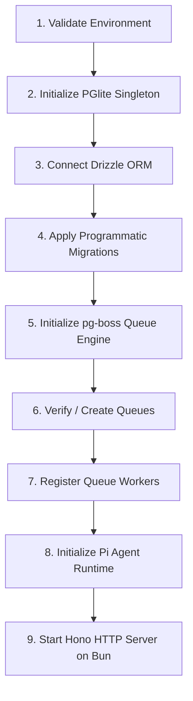

# Su Ky Agent Demo Monorepo

Full-stack demo proving zero-Docker, zero-Redis, and zero-external-Postgres architecture using embedded PGlite, local background queues with pg-boss, and the Pi coding agent runtime.

---

## Tech Stack

| Component | Technology | Role |
| :--- | :--- | :--- |
| **Runtime & Package Manager** | Bun 1.4+ | Monorepo package manager and high-performance server runtime |
| **Monorepo Build System** | Turborepo 2.x | Task orchestration and workspace management |
| **Frontend** | Next.js 15 (React 19) | App Router web dashboard (`apps/web`) |
| **Backend API** | Hono | Native Bun HTTP server framework (`apps/api`) |
| **Embedded Database** | PGlite (v0.2+) | In-process WebAssembly Postgres runtime (`packages/db`) |
| **ORM & Migrations** | Drizzle ORM | Type-safe schema definitions and programmatic migrations |
| **Job Queue** | pg-boss (v12+) | Background job processing powered directly by PGlite |
| **AI / Agent Engine** | Pi SDK (`@earendil-works/pi-coding-agent`) | Agent model runtime with OpenCode Go provider |
| **Validation & Contracts** | Zod (v3.24+) | Cross-boundary payload schemas and TypeScript types (`packages/contracts`) |

---

## Monorepo Structure

```
su-ky-agent-demo/
├── apps/
│   ├── api/                  # Hono backend API on Bun (Port 3001)
│   │   └── src/
│   │       ├── config/       # Environment validation (Zod)
│   │       ├── pi/           # Pi agent service runtime
│   │       ├── queue/        # pg-boss queue setup and background workers
│   │       ├── routes/       # API route handlers (health, queue, pi)
│   │       └── index.ts      # Server entrypoint and lifecycle orchestrator
│   └── web/                  # Next.js 15 App Router dashboard (Port 3000)
│       ├── app/              # Page layouts, styles, and UI components
│       └── lib/              # Client-side API fetchers
├── packages/
│   ├── contracts/            # Shared Zod schemas and TypeScript types (@repo/contracts)
│   │   └── src/              # Health, queue, and Pi schemas
│   └── db/                   # Embedded database layer (@repo/db)
│       ├── src/              # PGlite client, Drizzle schema, and programmatic migrator
│       ├── data/             # Local PGlite storage directory
│       └── drizzle/          # Generated SQL migration files
├── turbo.json                # Turborepo task pipeline configuration
├── package.json              # Bun workspace root configuration
├── .env.example              # Environment variables template
└── AGENTS.md                 # Monorepo architectural rules and conventions
```

### Architectural Invariants
1. **Single Database Owner**: `apps/api` is the sole runtime owner of `@repo/db` (PGlite and pg-boss). `apps/web` communicates exclusively via HTTP to `apps/api` and never imports `@repo/db`.
2. **Type-Safe Boundary**: All API request and response contracts are shared via `@repo/contracts`.
3. **Zero External Daemons**: No Docker containers, Redis instances, or external Postgres services required.

---

## Environment Setup

### 1. Prerequisites
- **Bun**: v1.2+ (Recommended: Bun v1.4+)
  ```bash
  curl -fsSL https://bun.sh/install | bash
  ```

### 2. Configure Environment Variables
Copy `.env.example` to create `.env` at the monorepo root:
```bash
cp .env.example .env
```

| Variable | Default Value | Description |
| :--- | :--- | :--- |
| `API_PORT` | `3001` | Port for the Hono backend server |
| `NEXT_PUBLIC_API_URL` | `http://localhost:3001` | Backend API URL used by the web frontend |
| `PGLITE_DATA_DIR` | `./packages/db/data/pgdata` | Data directory path for PGlite database persistence |
| `OPENCODE_API_KEY` | *(Optional)* | API key for OpenCode Go AI provider |
| `PI_PROVIDER` | `opencode-go` | Pi SDK provider identifier |
| `PI_MODEL` | `gemini-2.5-flash` | Pi SDK default model |

### 3. Install Dependencies
Install all workspace dependencies using Bun:
```bash
bun install
```

---

## Startup Lifecycle

The backend API (`apps/api/src/index.ts`) enforces an ordered 9-step startup lifecycle to guarantee service readiness before opening network traffic:



1. **Environment Validation**: Validates all required environment variables using Zod schemas (`env.ts`).
2. **PGlite Singleton Initialization**: Boots the in-process PGlite database engine using the configured data directory.
3. **Drizzle Connection**: Binds Drizzle ORM to the running PGlite instance.
4. **Database Migrations**: Runs programmatic migrations (`runMigrations`) from `./packages/db/drizzle`.
5. **pg-boss Engine Initialization**: Starts pg-boss using the internal PGlite connection adapter.
6. **Queue Provisioning**: Asserts creation of background queues (e.g., `demo-ping`).
7. **Worker Registration**: Registers event handlers and background processors for queues.
8. **Pi Agent Runtime Setup**: Configures model providers and initializes the Pi coding agent service.
9. **Hono Server Startup**: Binds `Bun.serve` on port `3001` with CORS and request-draining middleware.

### Graceful Shutdown
Upon receiving `SIGINT` or `SIGTERM`, `apps/api` executes an orderly shutdown:
1. Stops accepting incoming HTTP connections.
2. Drains active requests with a grace timeout.
3. Gracefully stops pg-boss queue consumers.
4. Closes the PGlite database client cleanly.

---

## Development Instructions

### Run Monorepo Concurrently
Start all applications (`apps/api` and `apps/web`) concurrently with live reload:

```bash
bun run dev
```

Turborepo will orchestrate:
- **Web Dashboard**: [http://localhost:3000](http://localhost:3000)
- **Backend API**: [http://localhost:3001](http://localhost:3001)

### Run Workspaces Individually
You can also run specific applications directly:

```bash
# Start backend API only (Port 3001)
bun --filter api dev

# Start frontend dashboard only (Port 3000)
bun --filter web dev
```

---

## API Endpoints

The backend exposes the following endpoints:

| Method | Endpoint | Description |
| :--- | :--- | :--- |
| `GET` | `/` | Basic API service greeting |
| `GET` | `/health` | Aggregate health status of API, database, queue, and Pi agent |
| `POST` | `/queue/test` | Enqueue a sample background job (`demo-ping`) to pg-boss |
| `POST` | `/pi/test` | Execute a sample prompt invocation with the Pi agent |
