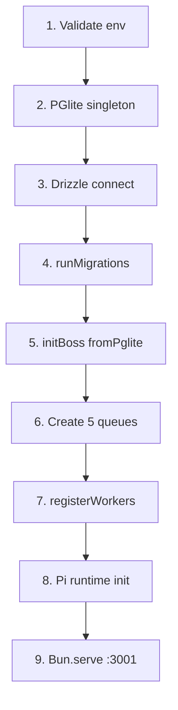

# Su Ky Agent Demo Monorepo

Full-stack demo proving zero-Docker, zero-Redis, and zero-external-Postgres architecture using embedded PGlite, local background queues with pg-boss, and the Pi coding agent runtime. Current focus: a 4-agent advertisement pipeline (Extractor → Planner → Writer → Reviewer) with a human-in-the-loop gate on the plan.

---

## Tech Stack

| Component | Technology | Role |
| :--- | :--- | :--- |
| **Runtime & Package Manager** | Bun 1.4+ | Monorepo package manager and high-performance server runtime |
| **Monorepo Build System** | Turborepo 2.x | Task orchestration and workspace management |
| **Frontend** | Next.js 15 (React 19) | App Router dashboard (`apps/web`) |
| **Backend API** | Hono | Native Bun HTTP server (`apps/api`, port 3001) |
| **Embedded Database** | PGlite (v0.2+) | In-process Postgres (`packages/db`) |
| **ORM & Migrations** | Drizzle ORM | Type-safe schema + programmatic migrations |
| **Job Queue** | pg-boss (v12+) | Background jobs via `fromPglite(pglite)` |
| **AI / Agent Engine** | Pi SDK (`@earendil-works/pi-coding-agent`) | Ephemeral sessions, OpenCode Go provider, `tools: []` |
| **Validation & Contracts** | Zod (v3.24+) | Cross-boundary schemas (`packages/contracts`) |

---

## Monorepo Structure

```
su-ky-agent-demo/
├── apps/
│   ├── api/src/
│   │   ├── config/       # env (Zod), logger
│   │   ├── pi/           # pi.service (ModelRuntime), pi.tracer (events → system_events)
│   │   ├── agents/       # agent-runner + extractor/planner/writer/reviewer + prompts
│   │   ├── queue/        # boss (singleton) + workers + jobs/*.job.ts
│   │   ├── workflow/     # workflow.types / service / repository
│   │   ├── routes/       # health, queue, pi, workflow, events (SSE)
│   │   └── index.ts      # 9-step boot + shutdown/drain
│   └── web/
│       ├── app/page.tsx  # dashboard: create → HITL card → ad card + TracePanel
│       ├── components/trace-panel.tsx # SSE timeline
│       └── lib/          # api.ts (health/queue/pi), workflow-api.ts (workflows + SSE)
├── packages/
│   ├── contracts/src/    # health, queue, pi + workflow/{api, product-data, content-plan, advertisement, review-result, events}
│   └── db/
│       ├── src/          # client (PGlite singleton), drizzle, migrate, schema/*
│       ├── drizzle/      # 0000 system_events, 0001 workflow_runs/steps/versions
│       └── data/pgdata/  # local PGlite storage (gitignored except .gitkeep)
├── turbo.json
├── .env.example
└── AGENTS.md
```

### Architectural Invariants
1. **Single Database Owner**: only `apps/api` imports `@repo/db`. `apps/web` talks HTTP only.
2. **Type-Safe Boundary**: every request/response has a Zod schema in `@repo/contracts`. API uses `.parse()`, web uses `safeParse()`.
3. **Zero External Daemons**: no Docker, Redis, or external Postgres.

---

## Environment Setup

### 1. Prerequisites
- **Bun** v1.4+ (`bun@1.4.0` in `packageManager`)
  ```bash
  curl -fsSL https://bun.sh/install | bash
  ```

### 2. Configure Environment
```bash
cp .env.example .env
```

| Variable | Default | Description |
| :--- | :--- | :--- |
| `API_PORT` | `3001` | Hono port |
| `WEB_URL` | `http://localhost:3000` | Allowed web origin |
| `LOG_LEVEL` | `debug` | pino level |
| `NEXT_PUBLIC_API_URL` | `http://localhost:3001` | API URL used by web |
| `PGLITE_DATA_DIR` | `./packages/db/data/pgdata` | PGlite persistence dir |
| `OPENCODE_API_KEY` | *(empty)* | OpenCode Go key (required for real Pi calls) |
| `PI_PROVIDER` | `opencode-go` | Pi provider id |
| `PI_MODEL` | *(none)* | Preferred model, takes precedence |
| `OPENCODE_MODEL` | *(none)* | Fallback model alias |
| `PI_THINKING_LEVEL` | `medium` | `off/minimal/low/medium/high/xhigh/max` |

Resolved model: `PI_MODEL || OPENCODE_MODEL || "minimax-m3"`. Pi stays non-ready until a model + key resolve; `/pi/test` then returns 503.

### 3. Install
```bash
bun install
```

---

## Startup Lifecycle

`apps/api/src/index.ts` boots in strict order, fail-fast (`process.exit(1)`) on migrate/boss/workers failure. `piService.init()` is non-fatal so `/health` can still report `pi: false`.



Queues: `demo-ping` + `agent.extract-product`, `agent.plan-content`, `agent.write-ad`, `agent.review-ad`.

### Graceful Shutdown
On `SIGINT`/`SIGTERM`: `server.stop(false)` → drain in-flight up to 3s (poll 50ms) → `server.stop(true)` if leftover → `stopBoss()` → `closePglite()`. New requests get 503 with `x-request-id` while draining.

---

## Workflow: 4-Agent Ad Pipeline

```
POST /workflows {rawText}
 → EXTRACTOR (product-data)
 → PLANNER (content-plan) → WAITING_FOR_HUMAN
 → approve → WRITER (advertisement) → REVIEWER (review-result) → COMPLETED
              ↳ regenerate {feedback, baseVersion} → PLANNER again (append-only version+1)
```

- **Append-only versions**: every attempt inserts a new `step_versions` row. Planner regenerate never overwrites.
- **HITL gate**: only the planner pauses for humans. Writer loads `loadApprovedPlannerOutput` and throws if no approved version.
- **Jobs**: `queue/jobs/*.job.ts` share one shape — set RUNNING + log → load previous output → `runStructuredAgent` → insert version → set next status. `AgentValidationError` or missing/not-found → FAILED terminal (no retry). Other errors → FAILED + rethrow for pg-boss retry (max 3).
- **Agents**: `runStructuredAgent(system, user, schema)` uses ephemeral Pi session (`tools: []`), JSON extraction with ``` fences, 1 schema retry, tracer attach, dispose in `finally`. Note: provider string is currently hardcoded to `"opencode-go"`.
- **Trace**: `pi.tracer` maps session events to `pi.<step>.<turn|message|tool>.*`, drops streaming noise, caps metadata at 4KB, writes to `system_events`.
- **DB tables**: `workflow_runs`, `workflow_steps`, `step_versions`, `system_events`. Status columns are plain `text`; Zod owns the enum.

Web flow (`app/page.tsx`): input → `createWorkflow` → poll `fetchWorkflow` every 1.5s → HITL card (version tabs + feedback/regenerate/approve) → completed ad card + review verdict → `TracePanel` subscribes SSE.

---

## Development

```bash
bun run dev        # web :3000 + api :3001 via Turborepo
bun run build      # topological build
bun run typecheck  # tsc --noEmit all workspaces
```

Individually:
```bash
bun --filter api dev
bun --filter web dev
```

No tests by policy (`AGENTS.md`). Verify with typecheck + build + endpoint probes + dashboard buttons.

---

## API Endpoints

| Method | Endpoint | Description |
| :--- | :--- | :--- |
| `GET` | `/` | Greeting |
| `GET` | `/health` | `SELECT 1` + boss queue check + Pi ready |
| `POST` | `/queue/test` | Send `demo-ping`, worker writes `system_events` |
| `POST` | `/pi/test` | Ephemeral Pi session, expects PONG (503 if not ready) |
| `POST` | `/workflows` | Create run (`rawText` trim, 10k cap), enqueue extractor, 201 `{id}` |
| `GET` | `/workflows/:id` | Run + steps + versions (versions newest-first) |
| `POST` | `/workflows/:id/planner/regenerate` | Needs `WAITING_FOR_HUMAN`, body `{feedback?, baseVersion?}` |
| `POST` | `/workflows/:id/planner/approve` | Needs `WAITING_FOR_HUMAN`, body `{version}`, enqueues writer |
| `GET` | `/events?workflowRunId&type&limit≤200` | Event list, oldest-first |
| `GET` | `/events/stream?workflowRunId&afterId` | SSE: `workflow-event` every 1s poll + `workflow-done`, 15s heartbeat, Last-Event-ID |
